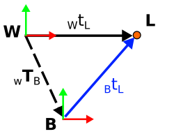

[2D odometry residual](#2D-odometry-residual)  
[3D odometry residual](#3D-odometry-residual)  
[2D matching residual](#2D-matching-residual)  
[3D matching residual](#3d-matching-residual)  
[2D bearing residual](#2D-bearing-residual)  

<ins>Nomenclature</ins>  
**B** is current body pose  
**A** is past pose  
**W** is world frame   
**L** is a landmark

The following are residuals for multiple different types of sensors. There is a
pattern with the way they're constructed. The optimization problem is to guess 
/ calculate the tranformation from the world frame to the body frame. To do 
this, the measurement vector is recreated using the optimization guess and the 
previous pose or the position of a landmark. 

### <ins>2D odometry residual</ins>  

  
$\ residual(_WT_A,\ _WT_B,\ _AT_B) $  

$\ _WT_A - \text{Previous pose, assume it's correct} $  
$\ _WT_B - \textup{The transform being optimized / calculated} $  
$\ _AT_B - \text{Odometry measurement} $  

$\ _A\hat{T}_B = ||_WT_B - _WT_A|| $  
$\ error = _A\hat{T}_B - _AT_B $  

------
### <ins>3D odometry residual</ins>

  
$\ residual(_WT_A,\ _WT_B,\ _AT_B,\ \sigma)  $  
$\ _WT_A - \text{Previous pose, assume it's correct} $  
$\ _WT_B - \textup{The transform being optimized / calculated} $  
$\ _AT_B - \text{Odometry measurement} $  
$\ \sigma - \text{Diagonal standard deviation of the tangent-space error} $ 

$\ _A\hat{T}_B = (_WT_A)^{-1}\cdot _WT_B  $  
$\ tangentError = _A\hat{T}_B.localCoordinates(_AT_B) $  
$\ residual = \sigma^{-1}\cdot tangentError $  

$\ \text{Note: localCoordinates computes the vector pointing from } $  
$\ _A\hat{T}_B \text{ to } _AT_B \text{ in the tangent space around }_A\hat{T}_B \text{ for the rotation.} $  
$\ \text{For the translation it is just a simple vector subtraction that} $  
$\ \text{outputs the vector from }_A\hat{T}_B \text{ to } _AT_B \text{ in Cartesian space}.  $  

------
### <ins>2D matching residual</ins>  

  
$\ residual(_Wt_L,\ _WT_B,\ _Bt_L,\ \sigma) $  
$\ _Wt_L - \text{Known global position of landmark} $  
$\ _WT_B - \text{The transform being optimized / calculated} $  
$\ _Bt_L - \text{Position measurement of landmark from current pose} $  
$\ \sigma - \text{Standard deviation of measurement} $  

$\ _B\hat{t}_L = (_WT_B)^{-1}\cdot _Wt_L $  
$\ error = \dfrac{_B\hat{t}_L - _Bt_L}{\sigma} $  

Note - The bigger the stddev, the less effect on the optimization  

-----
### <ins>3D matching residual</ins>  
The picture and equations for 3D are the exact same as the 2D case, the only difference is it is 3D instead of 2D.  

-----  
### <ins>2D bearing residual</ins>

  
$\ residual(_WT_B,\ _Wt_L,\ bearingAngle) $  
$\ _WT_B - \text{The transform being optimized / calculated} $  
$\ _Wt_L - \text{Known global position of landmark} $  
$\ bearingAngle - \text{Bearing angle measurement of landmark from robot} $  

$\ _Bt_L = (_WT_B)^{-1}\cdot _Wt_L $  
$\ \theta = atan2(_Bt_L[1],\ _Bt_L[0]) $  
$\ error = \theta - bearingAngle $

Note: Symforce has some built in factors [here](https://github.com/symforce-org/symforce/tree/main/symforce/codegen)  

Here are some for visual SLAM: 
* Inverse range landmark prior residual
* Inverse range landmark reprojection error residual
* Inverse range landmark ray reprojection error residual