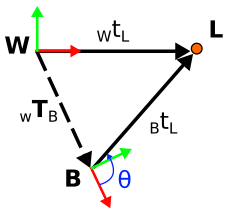

**B** is current body pose  
**A** is past pose  
**W** is world frame  

<ins>2D odometry residual</ins>  

  
$\ residual(_WT_A,\ _WT_B,\ _AT_B,\ \sigma) $  

$\ _WT_A - \text{Previous pose, assume it's correct} $  
$\ _WT_B - \textup{The transform being optimized / calculated} $  
$\ _AT_B - \text{Odometry measurement} $  

$\ error = ||_WT_B - _WT_A|| - _AT_B $  

------
<ins>3D odometry residual</ins>

  
$\ residual(_WT_A,\ _WT_B,\ _AT_B,\ \sigma)  $  
$\ _WT_A - \text{Previous pose, assume it's correct} $  
$\ _WT_B - \textup{The transform being optimized / calculated} $  
$\ _AT_B - \text{Odometry measurement} $  
$\ \sigma - \text{TODO: MAGICALLY HANDLED WITH TANGENT SPACE PERTUBATIONS} $  

$\ _A\hat{T}_B = (_WT_A)^{-1}\times _WT_B  $  
$\ tangentError = _A\hat{T}_B.localCoordinates(_AT_B) $

------
<ins>2D Matching residual </ins>  

  
$\ residual(_Wt_L,\ _WT_B,\ _Bt_L,\ \sigma) $  
$\ _Wt_L - \text{Known global position of landmark} $  
$\ _WT_B - \text{The transform being optimized / calculated} $  
$\ _Bt_L - \text{Position measurement of landmark from current pose} $  
$\ \sigma - \text{Standard deviation of measurement} $  

$\ _B\hat{t}_L = (_WT_B)^{-1}\times _Wt_L $  
$\ error = \dfrac{_B\hat{t}_L - _Bt_L}{\sigma} $  
Note - The bigger the stddev, the less effect on the optimization  
-----  
<ins>2D Bearing residual </ins>

  
$\ residual(_WT_B,\ _WT_L,\ bearingAngle) $  
$\ _WT_B - \text{The transform being optimized / calculated} $  
$\ _WT_L - \text{Known global position of landmark} $  
$\ bearingAngle - \text{Bearing angle measurement of landmark from robot} $  
